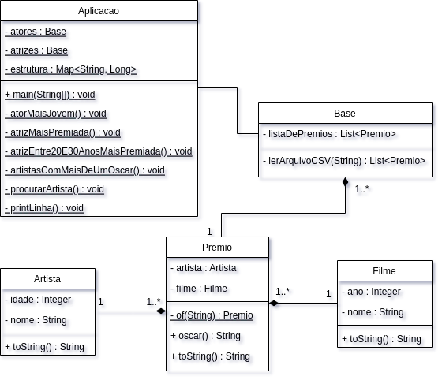

# Let's Code - Oscar


## Enunciado
Com base nos arquivos [oscar_age_male](oscar_age_male.csv) e [oscar_age_female](oscar_age_female.csv), escreva uma aplicação utilizando o framework Java Streams API para responder as seguintes funcionalidades.

1. Quem foi o ator mais jovem a ganhar um Oscar?
1. Quem foi a atriz que mais vezes foi premiada?
1. Qual atriz entre 20 e 30 anos que mais vezes foi vencedora?
1. Quais atores ou atrizes receberam mais de um Oscar? Elabore uma única estrutura contendo atores e atrizes.
1. Quando informado o nome de um ator ou atriz, dê um resumo de quantos prêmios ele/ela recebeu e liste ano, idade e nome de cada filme pelo qual foi premiado(a).

## Diagrama de classes



## Exemplo de execução
```
┌─────────────────────────────────────────────────────────────────────┐
│   ________  ________  ________  ________  ________  ________        │
│  |\   __  \|\   ____\|\   ____\|\   __  \|\   __  \|\   ____\       │
│  \ \  \|\  \ \  \___|\ \  \___|\ \  \|\  \ \  \|\  \ \  \___|_      │
│   \ \  \\\  \ \_____  \ \  \    \ \   __  \ \   _  _\ \_____  \     │
│    \ \  \\\  \|____|\  \ \  \____\ \  \ \  \ \  \\  \\|____|\  \    │
│     \ \_______\____\_\  \ \_______\ \__\ \__\ \__\\ _\ ____\_\  \   │
│      \|_______|\_________\|_______|\|__|\|__|\|__|\|__|\_________\  │
│               \|_________|                            \|_________|  │
│                                                                     │
└─────────────────────────────────────────────────────────────────────┘

\\\\\\\\\\\\\\\\\\\\\\\\\\\\\\\\\\\|///////////////////////////////////

Ator mais jovem a ganhar um oscar foi:
-> Adrien Brody aos 29 anos no filme The Pianist (2003).

\\\\\\\\\\\\\\\\\\\\\\\\\\\\\\\\\\\|///////////////////////////////////

Atriz mais premiada:
-> Katharine Hepburn com 4 oscars.

\\\\\\\\\\\\\\\\\\\\\\\\\\\\\\\\\\\|///////////////////////////////////

Atriz entre 20 e 30 anos mais premiada:
-> Jodie Foster com 2 oscars.
-> Bette Davis com 2 oscars.
-> Luise Rainer com 2 oscars.
-> Hilary Swank com 2 oscars.

\\\\\\\\\\\\\\\\\\\\\\\\\\\\\\\\\\\|///////////////////////////////////

Artistas que ganharam mais de um oscar:
-> Spencer Tracy com 2 oscars.
-> Jack Nicholson com 2 oscars.
-> Sally Field com 2 oscars.
-> Sean Penn com 2 oscars.
-> Bette Davis com 2 oscars.
-> Luise Rainer com 2 oscars.
-> Hilary Swank com 2 oscars.
-> Katharine Hepburn com 4 oscars.
-> Vivien Leigh com 2 oscars.
-> Jodie Foster com 2 oscars.
-> Fredric March com 2 oscars.
-> Ingrid Bergman com 2 oscars.
-> Olivia de Havilland com 2 oscars.
-> Elizabeth Taylor com 2 oscars.
-> Gary Cooper com 2 oscars.
-> Marlon Brando com 2 oscars.
-> Daniel Day-Lewis com 3 oscars.
-> Glenda Jackson com 2 oscars.
-> Meryl Streep com 2 oscars.
-> Tom Hanks com 2 oscars.
-> Dustin Hoffman com 2 oscars.
-> Jane Fonda com 2 oscars.

\\\\\\\\\\\\\\\\\\\\\\\\\\\\\\\\\\\|///////////////////////////////////

Insira o nome de um ator ou atriz para mais informações:
-> Tom Hanks

\\\\\\\\\\\\\\\\\\\\\\\\\\\\\\\\\\\|///////////////////////////////////

Tom Hanks ganhou 2 oscar(s) no(s) seguinte(s) filme(s):
-> Philadelphia (1994) aos 37 anos.
-> Forrest Gump (1995) aos 38 anos.

\\\\\\\\\\\\\\\\\\\\\\\\\\\\\\\\\\\|///////////////////////////////////

```